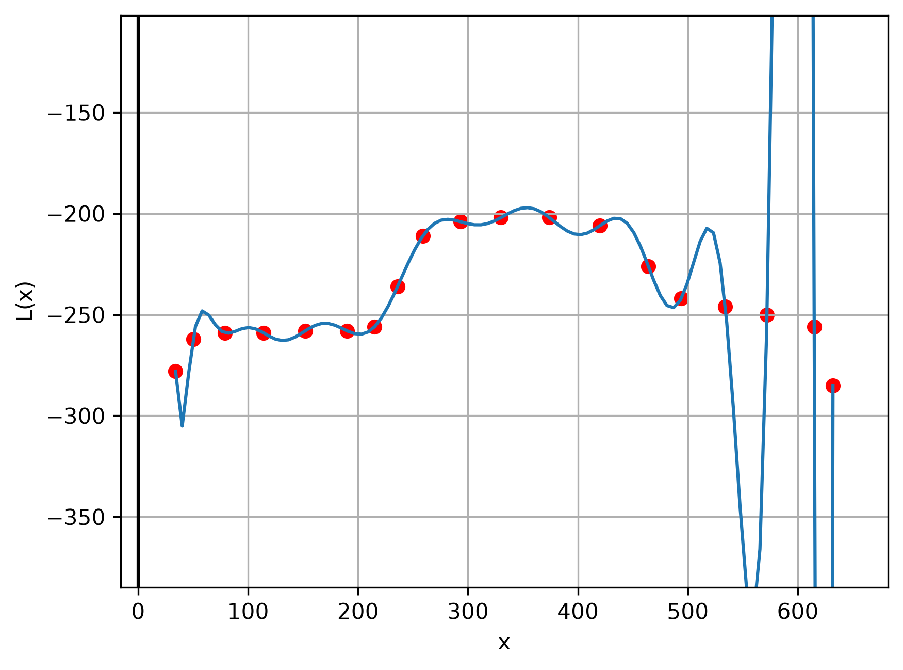
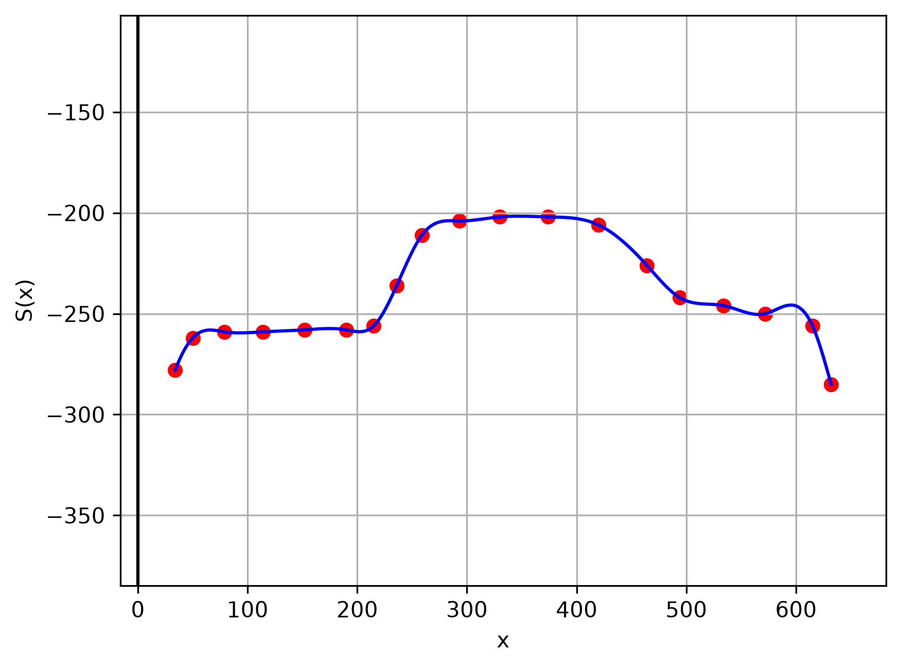
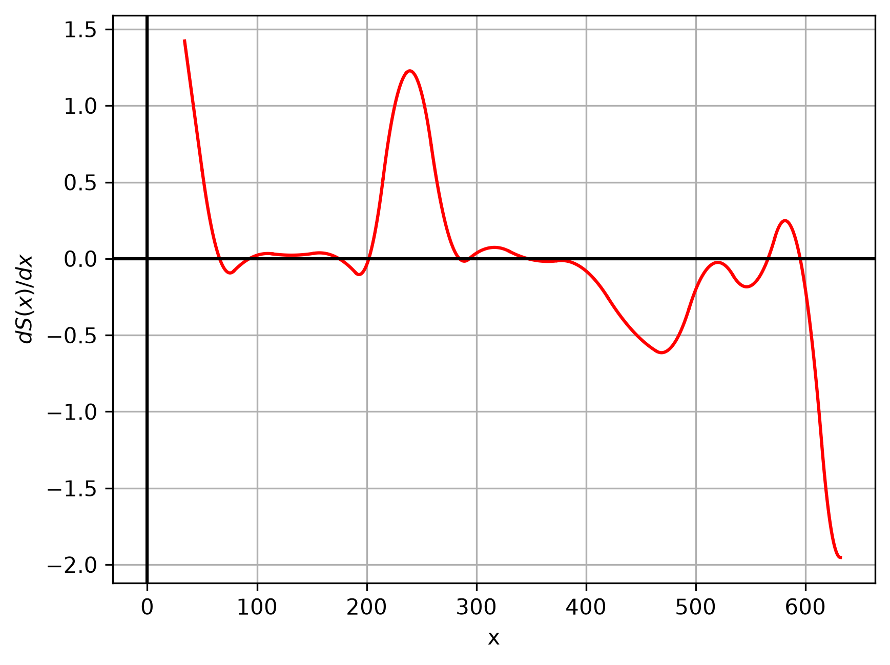
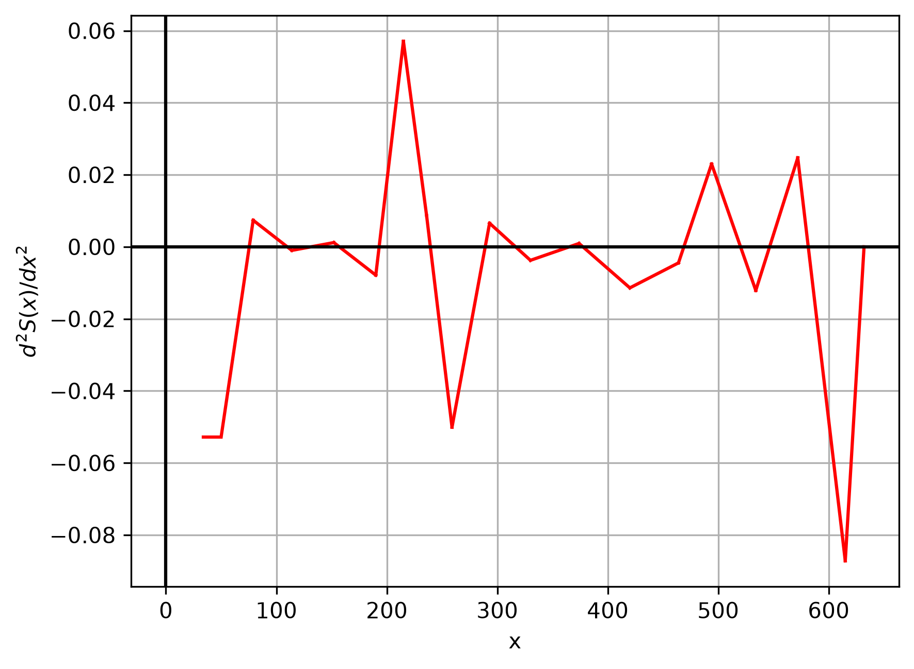
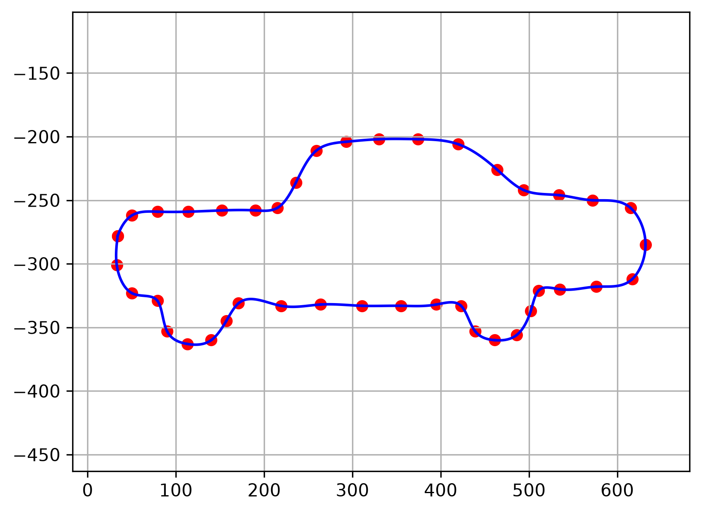

# Численные методы интерполяции

Учебный проект по численным методам, посвящённый реализации и сравнению различных методов интерполяции на Python.

В качестве исходных данных используются точки, полученные из контура изображения автомобиля. На их основе строятся интерполяционные кривые с помощью полинома Лагранжа и кубических сплайнов.

## Реализованные методы

В проекте реализованы:

- интерполяция полиномом Лагранжа в барицентрической форме;
- кубическая сплайн-интерполяция;
- вычисление первой производной кубического сплайна;
- вычисление второй производной кубического сплайна;
- параметрическая кубическая сплайн-интерполяция;
- визуализация результатов интерполяции.

Основные алгоритмы реализованы самостоятельно с использованием NumPy без готовых функций интерполяции из SciPy.

## Интерполяция полиномом Лагранжа

Для интерполяции верхнего контура автомобиля используется полином Лагранжа высокой степени.

Для вычисления значений полинома применяется его барицентрическая форма.



При большом количестве узлов полином высокой степени демонстрирует сильные осцилляции, особенно вблизи границ интервала.

Это показывает один из недостатков глобальной полиномиальной интерполяции при большом количестве узлов.

## Кубическая сплайн-интерполяция

Для получения более гладкого приближения используется кусочно-кубический сплайн.

На каждом интервале `[x_i, x_{i+1}]` сплайн имеет вид:

```text
S_i(x) = a_i
       + b_i(x - x_i)
       + c_i(x - x_i)^2
       + d_i(x - x_i)^3
```

Коэффициенты сплайна вычисляются через значения вторых производных в узлах интерполяции.

Для их определения формируется и решается система линейных уравнений.

Используются следующие краевые условия:

```text
m_0 = m_1
m_N = 0
```

где

```text
m_i = S''(x_i)
```



В отличие от полинома Лагранжа высокой степени, кубический сплайн позволяет получить значительно более гладкое приближение исходного контура.

## Производные сплайна

Для анализа построенного кубического сплайна также вычисляются его первая и вторая производные.

### Первая производная



Первая производная является непрерывной кусочно-квадратичной функцией.

### Вторая производная



Вторая производная является непрерывной кусочно-линейной функцией.

График также позволяет проверить выполнение заданного краевого условия на правом конце:

```text
S''(x_N) = 0
```

## Параметрическая сплайн-интерполяция

Обычная интерполяция вида `y = f(x)` не позволяет описать полный замкнутый контур автомобиля.

Поэтому используется параметризация кривой по длинам хорд:

```text
t_0 = 0

t_{k+1} - t_k =
sqrt((x_{k+1} - x_k)^2 + (y_{k+1} - y_k)^2)
```

После этого координаты рассматриваются как две отдельные функции параметра:

```text
x = S_x(t)
y = S_y(t)
```

Для каждой из них строится собственный кубический сплайн.



Такой подход позволяет восстановить полный двумерный контур по набору исходных точек.

## Используемые технологии

- Python
- NumPy
- Matplotlib

## Структура проекта

```text
Numerical-Interpolation-Methods/
│
├── main.py
├── Project.pdf
├── README.md
├── .gitignore
│
└── images/
    ├── nodes.png
    ├── lagrange.png
    ├── cubic_spline.png
    ├── parametric_spline.png
    ├── first_derivative.png
    └── second_derivative.png
```

## Математические выкладки

Подробный вывод системы уравнений для кубического сплайна, используемых краевых условий и описание результатов приведены в отчёте:

[Project.pdf](Project.pdf)

## Автор

**Иван Рензяев**

Московский государственный университет имени М. В. Ломоносова  
Факультет космических исследований
